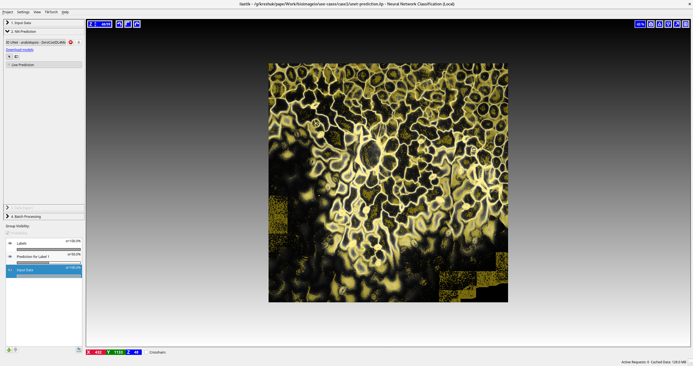
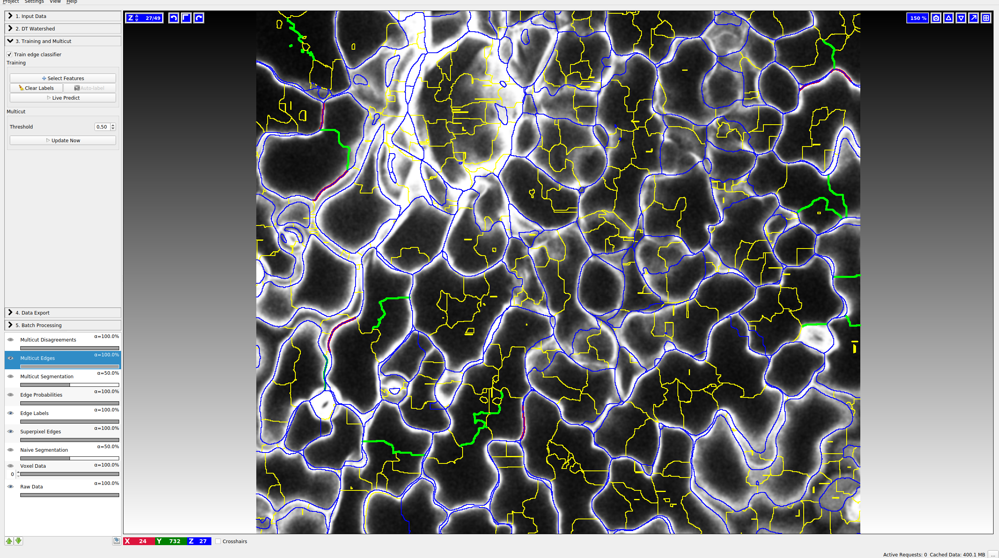
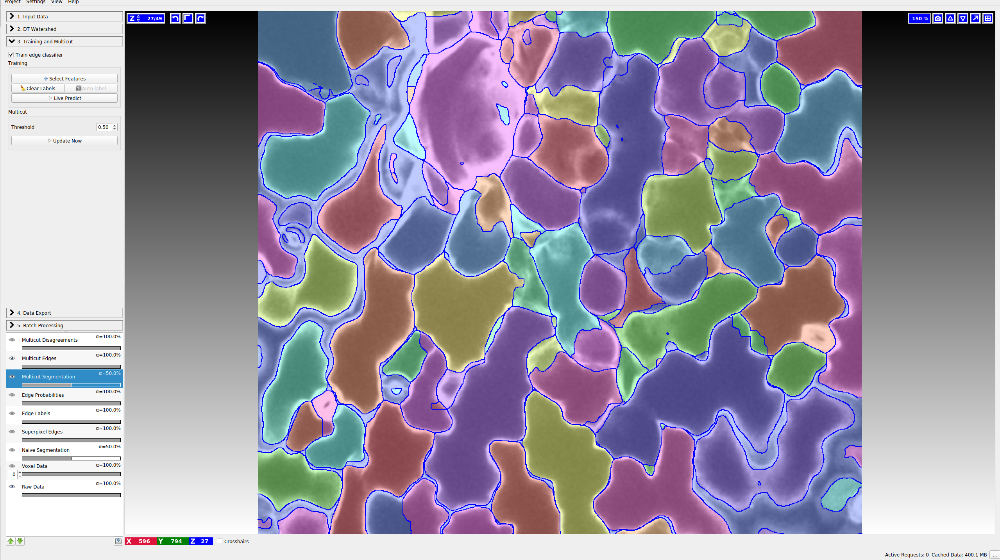

# Use-case 2: 3D U-Net for cell-segmentation in light microscopy

## Initial Training in ZeroCost

TODO: describe training in zerocost (@esgomezm)

## Application in ilastik

- Download the model with tensorflow weights for ilastik from: https://bioimage.io/#/?id=10.5281%2Fzenodo.5749843
- Download the Arabidopsis atlas data (different from the model training data!) from https://osf.io/fzr56/ (leaf)
- Crop the data and convert it to hdf5 with `to_h5.py` (could also use the ilastik data conversion workflow)
- ilastik neural network classification ([unet-prediction.ilp](TODO upload somewhere else, this is too large for GH))
    - Load the data
    - Load the model
    - Check the prediction
    - Export the prediction
- Create 4 smaller crops of the data and prediction for the multicut workflow with `cutouts_for_multicut.py`
- ilastik multicut workflow ([unet-segmentation.ilp](TODO upload somewhere else, this is too large for GH))
    - Load the data and predictions for block0
    - Train edge classifier on a few edges
    - Run segmentation for all 4 blocks (either using the prediction export applet or the `segment_multicut.py` script)

Integration with the multicut workflow enables cell segmentation based on the boundary predictions and allows to correct errors in the network prediction (that happen because of application to a different data modality) to be fixed by training an edge classifier.
See the screenshots below for prediction and multicut results in ilastik.

## Retraining in ZeroCost

- convert the raw data and segmentations for the 4 blocks to tif stacks with `convert_for_training.py`
- upload the resulting folder to your google drive so it can be loaded in the zero cost notebook for training and validation
- open the [3D U-Net zero cost notebook](https://colab.research.google.com/github/HenriquesLab/ZeroCostDL4Mic/blob/master/Colab_notebooks/U-Net_3D_ZeroCostDL4Mic.ipynb) in google colab
- load the [initial model](https://bioimage.io/#/?id=10.5281%2Fzenodo.5749843) and the training data from your google drive in the notebook and fine-tune the model for 15 iterations
- the fine-tuned model can be exported from the notebook, it's also available on bioimage.io: https://bioimage.io/#/?id=10.5281%2Fzenodo.6348728 

The fine-tuning significantly increses the model's performance for the leaf data, see a screenhot for a slice of the leaf raw data (left), predictions from the initial model (middle) and fine-tuned predictions (right) below. (On data not part of the training dataset.)

## Application in deepimageJ

- Predict on leaf data with DeepImageJ via `Run DeepImageJ`
- Use Morpholibj segmentation GUI for watershed based segmentation and label edit interface to correct labels
- Perform data measurements and plot them using the `plot.ijm` macro

See screenshots below for the steps:

### Dependencies

- ilastik: 1.4.0b21
- zeroCost 1.13
- Fiji 2.3.0
- DeepImageJ 2.1.15
