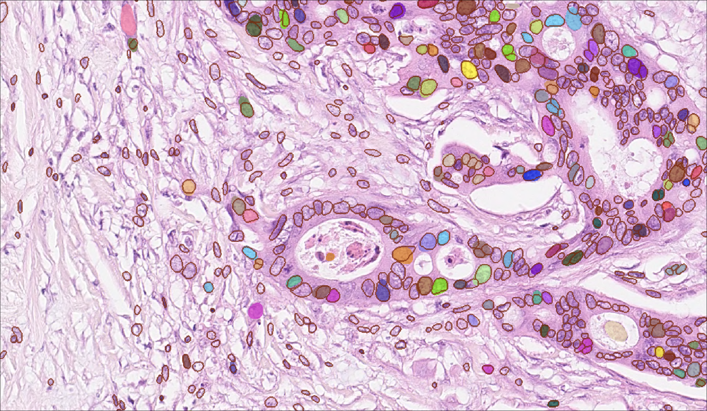

# Use-case 2: Stardist H&E nucleus segmentation

In this use-casel, we use the stardist H&E model pretrained on [MoNuSeg](https://monuseg.grand-challenge.org/Data/) and [TNBC](https://zenodo.org/record/1175282#.X6mwG9so-CN): https://bioimage.io/#/?tags=stardist&id=10.5281%2Fzenodo.6338614.
We apply it to the [Lizard dataset](https://warwick.ac.uk/fac/cross_fac/tia/data/lizard/), see the pretrained model applied to one of the lizard images below, colored instance masks are stardist predictions, red instance outlines mark the expected nuclei.

## Apply stardist model in QuPath and correct segmentation

TODO:
- check that we can apply the stardist model in bioimage.io format in QuPath
- apply in QuPath to data from lizard
- use qupath to correct predictions and export the corrected data for pre-training

## Retrain with corrected segmentation in zero-cost

TODO:
- use stardist modelzoo library in zero-cost notebook

## Apply retrained model in deepimagej

TODO:
- figure out how exactly to run stardist post-processing in deepIJ

## Evaluate retrained model in python

TODO:
- quantitatively compare performance of the retrained model with the pretrained model on the test images using the available ground-truth labels
