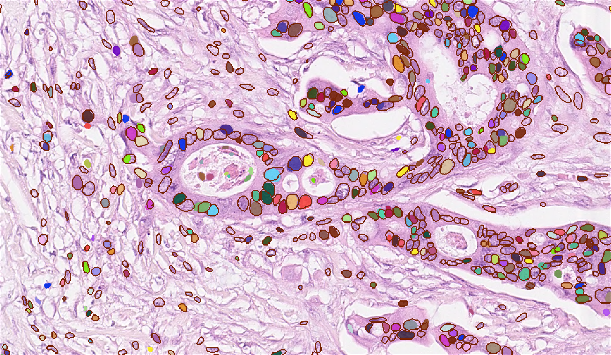

# Use-case 2: Stardist H&E nucleus segmentation

In this use-casel, we use the stardist H&E model pretrained on [MoNuSeg](https://monuseg.grand-challenge.org/Data/) and [TNBC](https://zenodo.org/record/1175282#.X6mwG9so-CN): https://bioimage.io/#/?tags=stardist&id=10.5281%2Fzenodo.6338614.
We apply it to the [Lizard dataset](https://warwick.ac.uk/fac/cross_fac/tia/data/lizard/), see the pretrained model applied to one of the lizard images below, colored instance masks are stardist predictions, red instance outlines mark the expected nuclei.

Note that the images are upscaled by a factor of 2 to match the resolution of images that the stardist model was trained on.

## Apply stardist model in QuPath and correct segmentation

We apply the pretrained H&E model to some images from Lizard and correct the predictions:
- Run `prepare_data_for_qupath.py` to select and rescale the data for QuPath
- Download the stardist model with `download_stardist.py` (TODO: change this script if we implement https://github.com/stardist/stardist/pull/187)
- Prepare QuPath for running StarDist:
  - install the StarDist extension: https://qupath.readthedocs.io/en/stable/docs/advanced/stardist.html#getting-the-stardist-extension
  - install the tensorflow extension: https://qupath.readthedocs.io/en/stable/docs/advanced/stardist.html#use-tensorflow
- Apply stardist to the lizard images with the `apply_stardist_qupath.groovy` script using the [QuPath scripting functionality](https://qupath.readthedocs.io/en/stable/docs/scripting/workflows_to_scripts.html#running-a-script-for-a-single-image). 
  - To run it adapt the path to the model in  
- Correct the predictions and export via (TODO need a script for this)

## Retrain with corrected segmentation in zero-cost

TODO:
- use stardist modelzoo library in zero-cost notebook

## Apply retrained model in deepimagej

TODO:
- figure out how exactly to run stardist post-processing in deepIJ

## Evaluate retrained model in python

TODO:
- quantitatively compare performance of the retrained model with the pretrained model on the test images using the available ground-truth labels
