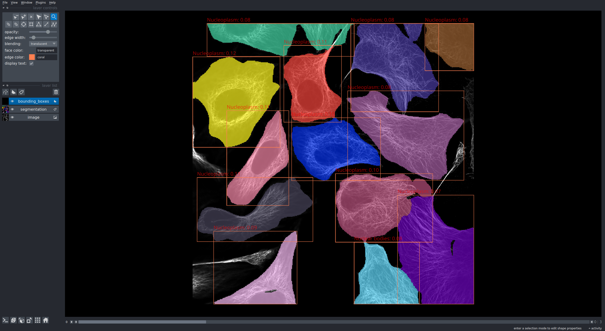
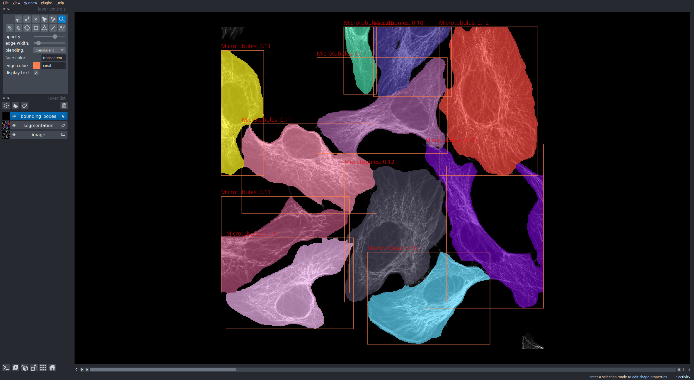

# Use-case 3: Classification, imjoy & python library usage

This use-case wraps the best performing approach of the [Kaggle Human Protein Atlas - Single Cell Classiication Challenge](https://www.kaggle.com/c/hpa-single-cell-image-classification).
It first segments the cells in the images using [a model](TODO bioimageio link) that predicts cell foreground and boundaries for inputs to a seeded watershed, with seeds from a [separate model for nucleus segmentation](TODO bioimageio link).
The model 10.5281/zenodo.5910855 (not on the website yet, PR: https://github.com/bioimage-io/collection-bioimage-io/pull/266) then classifies the individual cells.

We demonstrate how this approach can be wrapped for 3 different backends using the bioimageio models and consumer software.

## Usage in python library

The `hpa_app.py` scrips loads data from the hpa website, runs cell segmentation and then classifies each cell.
To this end it makes use of the python [bioimageio.core](ihttps://github.com/bioimage-io/core-bioimage-io-python) library that allows to integrate bioimageio models into any python application.
It uses [napari](https://github.com/napari/napari) to visualize the segmentation and classification results. See the results or two images, one with nucleoplasm staining, the other with microtubulus staining below.

## Usage in imjoy / bioengine

TODO

## Usage in deepimagej

TODO
