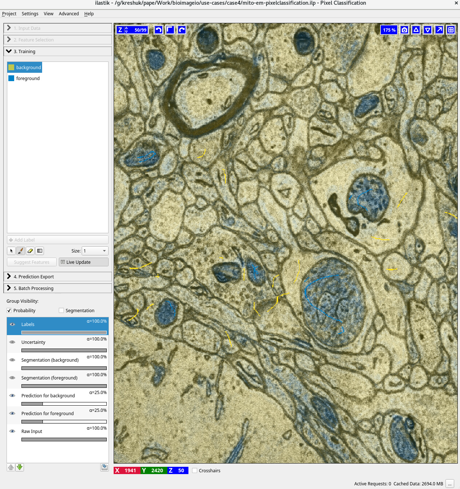
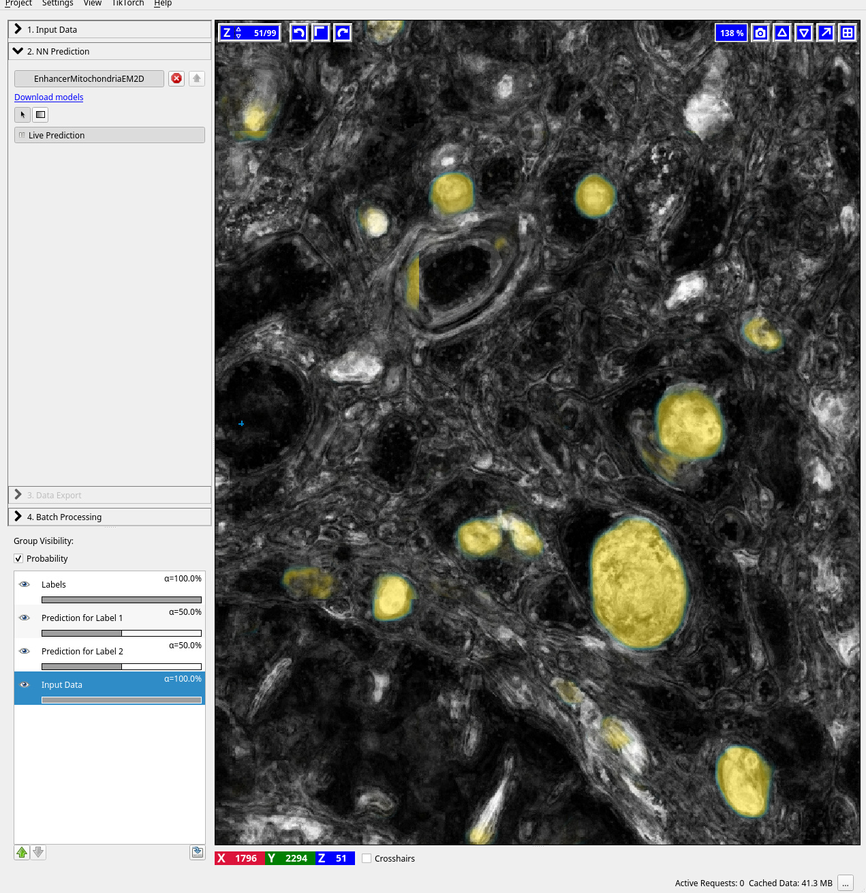
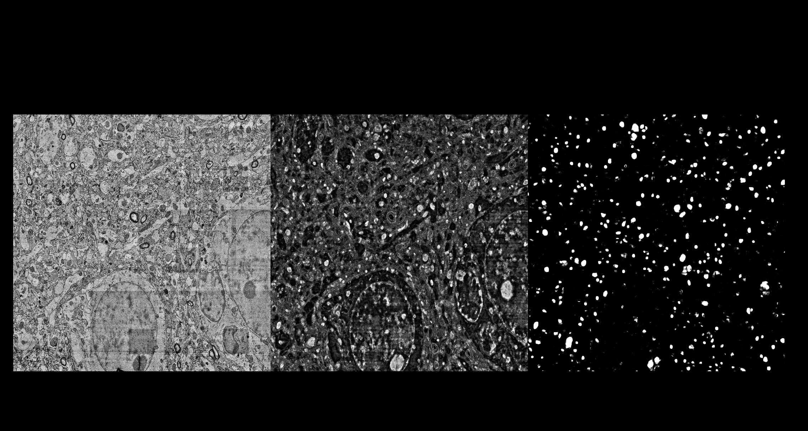

# Use-case 4: Domain adaptation for mitochondria segmentation in EM

This use-case shows how a method for domain adaptation can be made easily accessible through the model zoo. 
We use the Shallow2Deep method from https://doi.org/10.3389/fcomp.2022.805166, which trains a model, the enhancer, to improve predictions from a shallow classifier (Random Forest) on source data with dense segmentation labels.
This model can then be applied for data in a target domain, where no dense labels are available, by interactively training a shallow classifier and then improving its predictions with the enhancer.
Here, we demonstrate the approach for mitochondria segmentation in EM.

## Training and export in python

The `training` folder contains the scripts to train the enhancer. Note that this only needs to be done once and then this enhancer can be used to improve 2D mitochondria EM segmentation results.

## Application in ilastik

- train and predict with pixel classification on the [Mito EM dataset](https://mitoem.grand-challenge.org/)
- apply NeuralNetworkWorkflow to the pixel classification output using [the enhancer from the model zoo](https://bioimage.io/#/?tags=mitochondria&id=10.5281%2Fzenodo.6406756)

The screenshots below show interactive training of the RF in ilastik (pixelclassification) on MitoEM, application of the Enhancer in ilastik (Neural Network classification) and an overview of both the RF and enhancer predictions for a full slice of the MitoEM data. 

## Application in Deep ImageJ

TODO
- train and predict RF with weka
- apply enhancer with DIJ to its predictions
